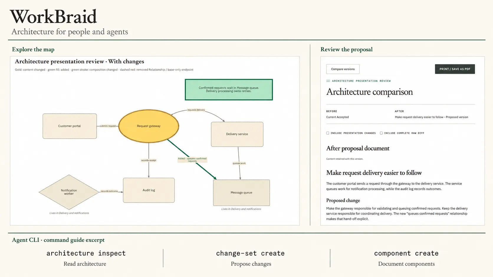

# WorkBraid

**Understand your architecture. Let agents propose what comes next.**

A local architecture workbench for people and coding agents.



- **A map with context** — connect components, write their documentation, and drill into detailed diagrams.
- **Changes you can review** — keep named proposals separate from accepted architecture. Compare before and after, leave proposal feedback, then accept it.
- **Agents at the same desk** — read architecture and create proposals through the CLI or MCP, then open the result in your browser.
- **Parallel ideas** — keep independent proposals, then combine them when you choose.
- **Reports you can share** — compare versions and print diagrams, proposal text, and changes to PDF from your browser.

## Run from source

Needs **Go 1.26+**, **Node.js 24+** (recommended), **npm**, and **Git on PATH**. From this checkout, in a Unix shell:

```sh
npm ci --prefix frontend
npm run build --prefix frontend
go build -o bin/workbraid ./cmd/workbraid
./bin/workbraid --listen 127.0.0.1:8080 --ui-dir frontend/dist
```

Open [127.0.0.1:8080](http://127.0.0.1:8080), create a **New project**, and add your first component. Keep the server running while using the browser or agents.

## Connect an agent

Have your agent read the built-in guide, then inspect the running app:

```sh
./bin/workbraid --skill
./bin/workbraid --json status
./bin/workbraid --json project list
```

For an MCP client, add a **stdio** server using your binary's absolute path:

```json
{
  "command": "/absolute/path/to/bin/workbraid",
  "args": ["mcp"]
}
```

The app must already be running. For another address, put `"--server", "http://127.0.0.1:8081"` before `"mcp"` in the arguments.

The guide covers reading, authoring, and review. `--help` lists commands; global flags go before the command. Agent proposals stay pending until explicitly accepted.

## Your work stays local

WorkBraid saves projects in private Git repositories on your machine, separate from your source code. It does not scan or modify your source repository. Data lives in the `workbraid` folder in your system's user configuration directory; `--data-dir` or `WORKBRAID_DATA_DIR` chooses another location. Back up that whole folder, and use one running server per data folder.

**Alpha:** build from source. Designed for a local desktop browser; no sign-in, hosted collaboration, or automatic source-code import. Your agent's own data-sharing settings still apply.

<a id="current-work-and-contracts"></a>

## Developer docs

[Agent guide](AGENTS.md) · [Roadmap](docs/roadmap.md)

<details>
<summary>Living contracts</summary>

[Architecture](docs/architecture-v0.md) · [UI](docs/ui-v0.md) · [Agent access](docs/architecture-agent-access-v0.md) · [Proposals and reviews](docs/architecture-proposals-v0.md) · [Combining proposals](docs/architecture-reconciliation-v0.md) · [Diagram layout](docs/architecture-placement-amendment-v0.md)

</details>

[Apache License 2.0](LICENSE).
